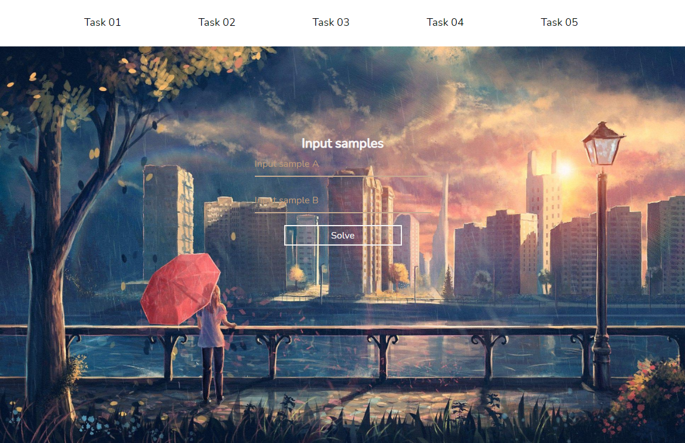

# Math statistics sprints

<section>
  <h3> ### About ### </h3>
  <h3> Web Application written in flask</h3>
  </img>
  
</section>
<section>
  <h3> ### TASKS ### </h3>
  <h3> Task 01 </h3>
  
For two samples to compile a variation series, to determine the range of the sample.
    Calculate and enter in a separate table the accumulated frequencies, relative frequencies and cumulative relative frequencies. 

  <h3> Task 02 </h3>
  <ul> 
    <li>Plotting graphs of variation series (polygon and histogram)</li>
    <li>Draw up an empirical distribution function</li>
    <li>Build a graph of the empirical distribution function</li>
   </ul>
   <h3> Task 03 </h3>
   <ul>
      <li>Sample mean</li>
      <li>Median</li>
      <li>Fashion</li>
      <li>Sample variance</li>
      <li>Sample standard deviation</li>
      <li>The coefficient of variation</li>
      <li>Central moments 3, 4</li>
      <li>Asymmetry</li>
      <li>Excess</li>
      <li>Variance fixed</li>
      <li>Corrected standard deviation</li>
   </ul>
  <h3> Task 04 </h3>
  
Compute point estimates of the distribution parameters (assume that the random variable is normally distributed) 
    by the method of moments and the method of largest similarity

  <h3> Task 05 </h3>
  
Implement the definitions of interval estimates of the mathematical expectation and standard deviation at the confidence level Pdov = 0.95 under various conditions (assume that the random variable is normally distributed)

</section>
